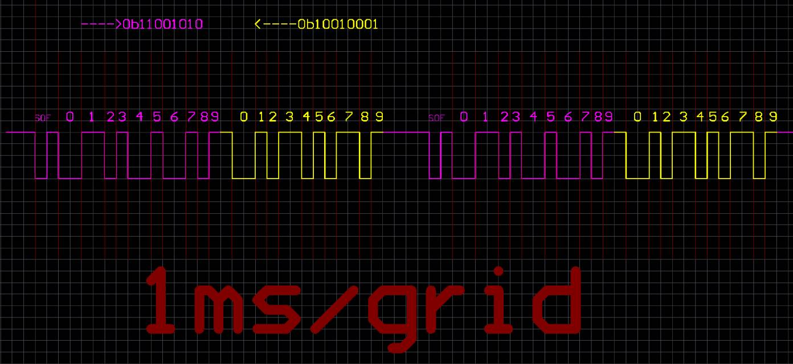
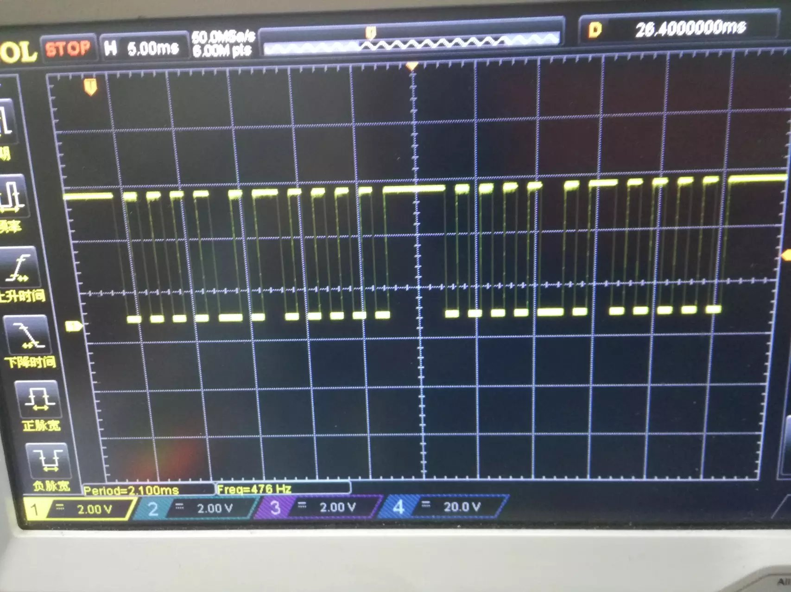
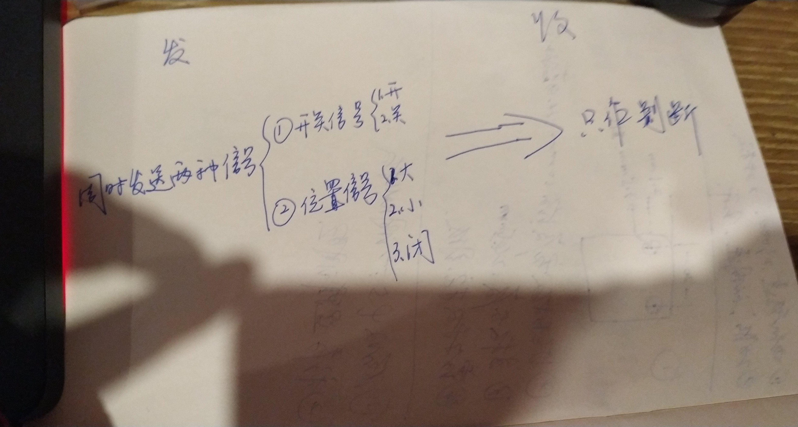
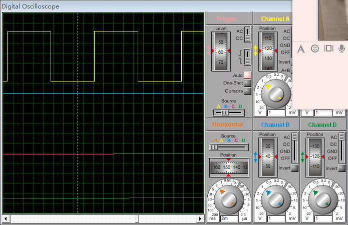

# minglie_mcu_single_line的c51 demo

minglie_mcu_single_line 是周期,低速,双向,软件型的通信,为了能快速的移到具体的板子上和需要使用的朋友学习写个demo

硬件型通信,编码需要照着芯片手册来做,不通用,也不会有一点个人发挥的技巧

## 外面是c51版本的

## stm32 里是stm32103R6版本的

## 周期/事件   高速/低速  单向/双向    硬件/软件
#
### 周期  
趁用其他心跳周期,安全可靠(自带看门狗)，时延长，轮询,无用信号多,费电
### 事件
要用到中断资源,时延短
#
### 高速
时延低,费电,不健壮
### 低速
时延高,省电,健壮
#
### 单向
编码简单,健壮,功能弱
### 双向
编码复杂,不健壮,功能强
#
### 硬件
编码简单,健壮,硬件约束成本高
### 软件
编码复杂,不健壮,无约束成本低,纯IO型,4毛单片机 搞定

注意
1. 参照ucos的系统延时,用挂起心跳周期数代替延时心跳周期数,非阻塞延时数只能是心跳周期的倍数

2. 用状态机step代替PC指针，任务恢复后能接着执行

3. 只要两类信号,只有很少几种状态并且是单向的不要用minglie_mcu_single_lines,用高低电平时长区分即可

4. 通信线剪断后再接上minglie_mcu_single_line能自恢复

5. 两个板子如果有迫不得已必须要破坏心跳周期,或者某段时间信号可能被干扰,比如无刷电机启动,则恢复正常后需要放弃1个周期的数据

